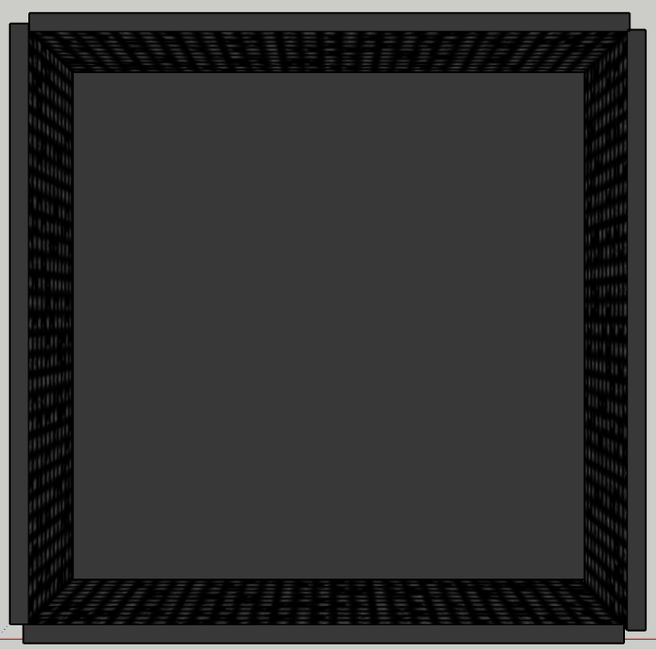
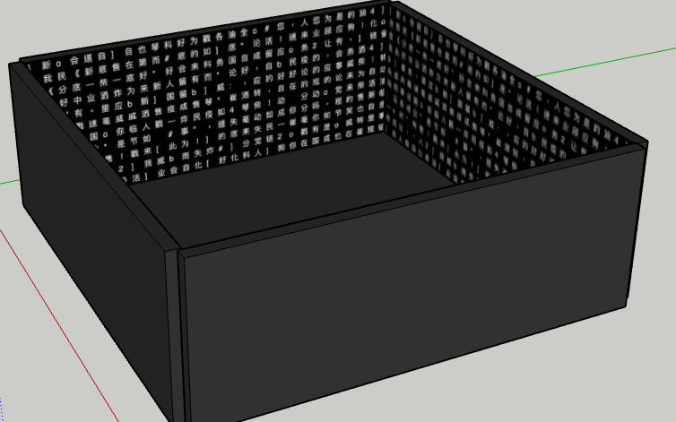

# Unerasable Characters II

*Unerasable Characters II: A fast forward illustration on how tweets are disappeared online*

[Click to RUN in your web browser](http://www.siusoon.net/projects/projects_mediaart/erasure/)

The project explores the politics of erasure and the temporality of voices within the context of digital authoritarianism. It presents the sheer scale of unheard voices by technically examining and culturally reflecting the endlessness, and its wider consequences, of censorship that is implemented through technological platforms and infrastructure.

Unerasable Characters II: As part of the series Unerasable Characters, this version consists of a custom-software (written in python & p5.js) that constantly scrapes the erased “tweets” from Weiboscope on a daily basis. Visually presenting the erased archives in a grid format, and each tweet is deconstructed into a character-by-character display (where each tweet with one character display at a time), the installation space will then fill with text and silence. The duration of each ‘tweet’ is computed and translated from the original visible time online, which is calculated from subtracting each single tweet's erased time and created time. As a result, the number of visible characters on the projected screens will decrease over time until all the text is fully disappeared. By then, the program will automatically pick up a new set of erased text and the cycle repeats. 

The project collects voices in the form of censored/erased (permission denied) text from Weibo via the platform called [weiboscope](https://weiboscope.jmsc.hku.hk/), developed by Dr. Fu, King Wa from Hong Kong University. Technically, it uses python for daily web scraping with limited data available (only past 7 days, max 200 records), and the front-end piece is written in p5.js with the max of 1 year storage of the erased data. Based on previous experiences, it will take the average of 3 hours for the erasure (which is also the time gap of the actual visibility of tweets). 

*still in a fine-tuning stage

More info on the text from Weiboscope:  Fu, King-wa and Chan, Chung-hong and Chau, Michael, Assessing Censorship on Microblogs in China: Discriminatory Keyword Analysis and Impact Evaluation of the 'Real Name Registration' Policy (May 15, 2013). IEEE Internet Computing, Vol. 17, No. 3, pp. 42-50, May-June 2013, doi:10.1109/MIC.2013.28. Available at SSRN: https://ssrn.com/abstract=2265271

Proposed installation setup:

running Unerasable Characters II at time T:

running Unerasable Characters II at time T + duration X 

